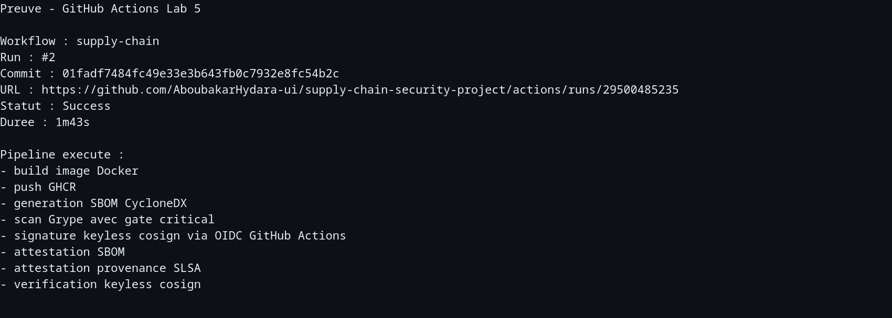
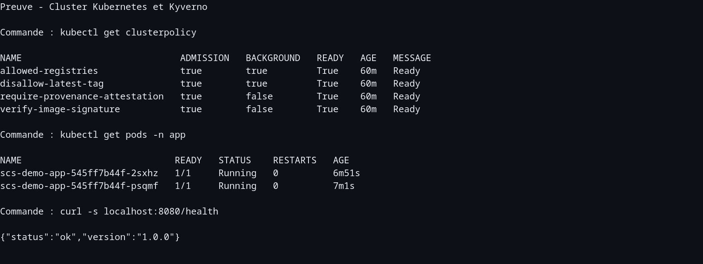
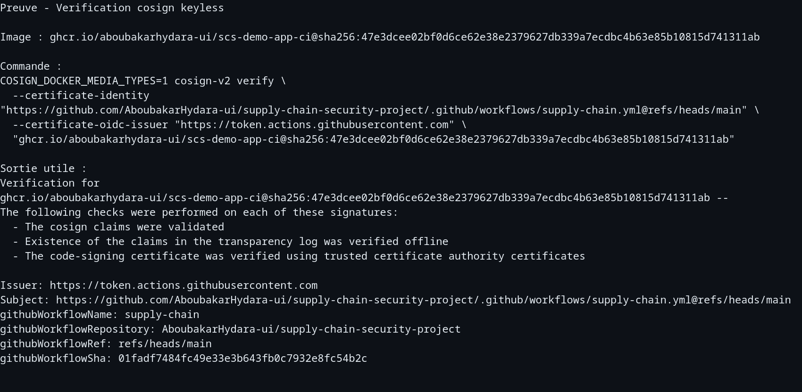
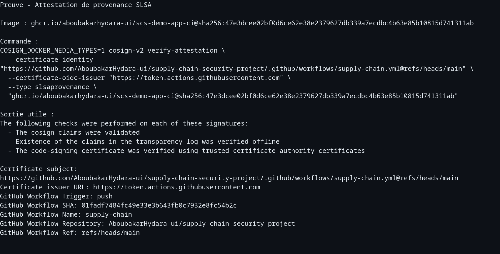
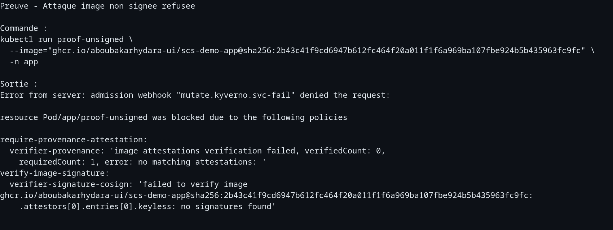
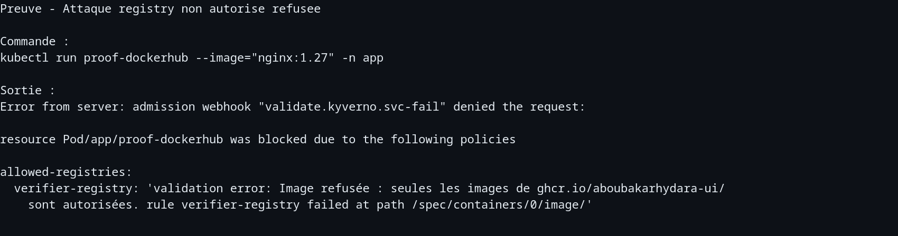
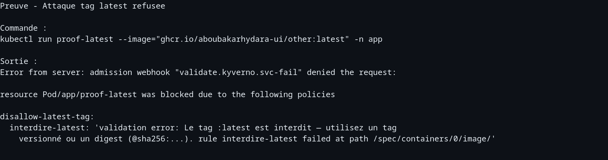
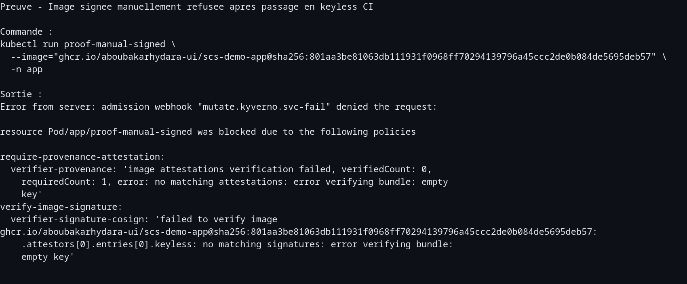
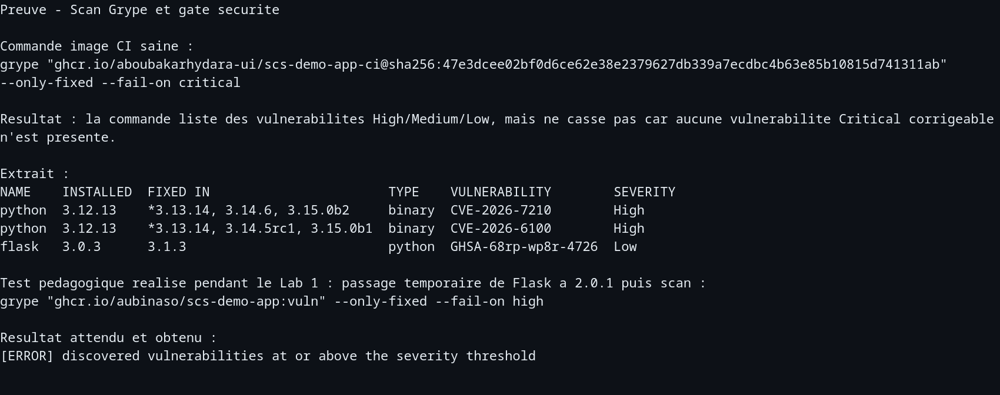

# Rapport - Chaine d'approvisionnement logicielle securisee

- **Groupe :** Aboubakar Hydara
- **Fork :** https://github.com/AboubakarHydara-ui/supply-chain-security-project
- **Voie :** Local avec Docker, kind, Kubernetes, Kyverno, GHCR et GitHub Actions
- **Date :** 16 juillet 2026

## 1. Contexte et objectif

L'objectif du projet est de transformer un pipeline classique en chaine d'approvisionnement logicielle verifiable. Le probleme traite n'est pas seulement de construire une image Docker, mais de prouver que l'image executee dans Kubernetes est bien celle produite par notre chaine de build, depuis le code attendu, et non une image modifiee, remplacee ou issue d'un registry non autorise.

Les attaques recentes montrent que la cible n'est plus uniquement l'application finale. La chaine de build, les dependances et les registries sont des points critiques. SolarWinds a illustre le risque d'artefact altere dans le processus de build. Codecov a montre qu'un script CI compromis peut exfiltrer des secrets. L'incident XZ Utils montre qu'une dependance open source peut etre progressivement compromise. Le projet repond a ces risques avec SBOM, scan, signature, attestations de provenance et politiques d'admission.

## 2. Architecture de la chaine

La chaine mise en place est la suivante :

```text
Code source
  -> build Docker
  -> generation SBOM avec Syft
  -> scan securite avec Grype
  -> push image dans GHCR
  -> signature cosign keyless via OIDC GitHub Actions
  -> attestation SBOM
  -> attestation de provenance SLSA
  -> admission Kubernetes controlee par Kyverno
```

Les outils utilises sont :

| Outil | Role |
|---|---|
| Docker | Construire et pousser l'image applicative |
| GHCR | Registry OCI pour stocker l'image, les signatures et les attestations |
| Syft | Generer le SBOM, c'est-a-dire la liste des composants logiciels |
| Grype | Scanner l'image et casser le pipeline si une vulnerabilite critique corrigeable est presente |
| cosign / Sigstore | Signer l'image et les attestations |
| GitHub Actions | Build heberge et signature keyless avec identite OIDC du workflow |
| kind | Cluster Kubernetes local |
| Kyverno | Admission controller qui refuse les images non conformes |

L'image finale de demonstration issue de la CI est :

```text
ghcr.io/aboubakarhydara-ui/scs-demo-app-ci@sha256:47e3dcee02bf0d6ce62e38e2379627db339a7ecdbc4b63e85b10815d741311ab
```

## 3. Mise en oeuvre et preuves

### 3.1 Build et test applicatif

L'application est une API Flask exposee sur le port `8080`. Le build local a ete valide avec Docker, puis l'application a ete testee sur `/health`.

Commande de preuve :

```bash
curl -s localhost:8080/health
```

Sortie :

```json
{"status":"ok","version":"1.0.0"}
```

Voir aussi `livrables/captures/02-cluster-policies-running.txt`.

### 3.2 SBOM avec Syft

Un SBOM a ete genere pour l'image. Deux formats ont ete utilises pendant les labs : SPDX JSON et CycloneDX JSON.

Commandes :

```bash
syft "$IMG:$TAG" -o spdx-json > sbom.spdx.json
syft "$IMG:$TAG" -o cyclonedx-json > sbom.cdx.json
```

Dans le workflow CI final, le SBOM utilise est CycloneDX afin de limiter la taille de l'attestation et d'eviter les problemes de limite de contexte cote Kyverno.

### 3.3 Scan avec Grype

La politique Grype est definie dans `.grype.yaml` :

```yaml
only-fixed: true
fail-on-severity: critical
```

La commande de scan de l'image CI est :

```bash
grype "ghcr.io/aboubakarhydara-ui/scs-demo-app-ci@sha256:47e3dcee02bf0d6ce62e38e2379627db339a7ecdbc4b63e85b10815d741311ab" --only-fixed --fail-on critical
```

Le scan liste des vulnerabilites High/Medium/Low, mais ne casse pas le pipeline car aucune vulnerabilite Critical corrigeable n'est presente. Pendant le Lab 1, une version vulnerable de Flask (`Flask==2.0.1`) a ete injectee temporairement pour verifier que la gate casse bien le build avec `--fail-on high`.

Preuve : `livrables/captures/09-grype-scan-gate.txt` et capture image `livrables/captures-images/09-grype-scan-gate.png`.

### 3.4 Signature cosign keyless

La signature finale est faite dans GitHub Actions en mode keyless. Il n'y a donc pas de cle privee stockee dans le repo. L'identite de signature est l'identite OIDC du workflow :

```text
https://github.com/AboubakarHydara-ui/supply-chain-security-project/.github/workflows/supply-chain.yml@refs/heads/main
```

Commande de verification :

```bash
COSIGN_DOCKER_MEDIA_TYPES=1 cosign-v2 verify \
  --certificate-identity "https://github.com/AboubakarHydara-ui/supply-chain-security-project/.github/workflows/supply-chain.yml@refs/heads/main" \
  --certificate-oidc-issuer "https://token.actions.githubusercontent.com" \
  "ghcr.io/aboubakarhydara-ui/scs-demo-app-ci@sha256:47e3dcee02bf0d6ce62e38e2379627db339a7ecdbc4b63e85b10815d741311ab"
```

Sortie utile :

```text
The cosign claims were validated
Existence of the claims in the transparency log was verified offline
The code-signing certificate was verified using trusted certificate authority certificates
Issuer: https://token.actions.githubusercontent.com
Subject: https://github.com/AboubakarHydara-ui/supply-chain-security-project/.github/workflows/supply-chain.yml@refs/heads/main
```

Preuve complete : `livrables/captures/03-cosign-keyless-verify.txt` et capture image `livrables/captures-images/03-cosign-keyless-verify.png`.

### 3.5 Attestations SBOM et provenance

Le workflow GitHub Actions attache deux attestations :

- une attestation SBOM CycloneDX ;
- une attestation de provenance SLSA.

Commande de verification de la provenance :

```bash
COSIGN_DOCKER_MEDIA_TYPES=1 cosign-v2 verify-attestation \
  --certificate-identity "https://github.com/AboubakarHydara-ui/supply-chain-security-project/.github/workflows/supply-chain.yml@refs/heads/main" \
  --certificate-oidc-issuer "https://token.actions.githubusercontent.com" \
  --type slsaprovenance \
  "ghcr.io/aboubakarhydara-ui/scs-demo-app-ci@sha256:47e3dcee02bf0d6ce62e38e2379627db339a7ecdbc4b63e85b10815d741311ab"
```

Sortie utile :

```text
Certificate subject: https://github.com/AboubakarHydara-ui/supply-chain-security-project/.github/workflows/supply-chain.yml@refs/heads/main
Certificate issuer URL: https://token.actions.githubusercontent.com
GitHub Workflow Trigger: push
GitHub Workflow SHA: 01fadf7484fc49e33e3b643fb0c7932e8fc54b2c
GitHub Workflow Name: supply-chain
GitHub Workflow Repository: AboubakarHydara-ui/supply-chain-security-project
GitHub Workflow Ref: refs/heads/main
```

Preuve complete : `livrables/captures/04-provenance-attestation.txt` et capture image `livrables/captures-images/04-provenance-attestation.png`.

### 3.6 Admission Kyverno

Quatre politiques Kyverno sont appliquees :

| Politique | Objectif |
|---|---|
| `allowed-registries` | Refuser les images hors `ghcr.io/aboubakarhydara-ui/` |
| `disallow-latest-tag` | Refuser les tags `:latest` |
| `verify-image-signature` | Exiger une signature keyless du workflow GitHub Actions |
| `require-provenance-attestation` | Exiger une provenance SLSA signee par le workflow |

Etat des politiques :

```text
NAME                             ADMISSION   BACKGROUND   READY   MESSAGE
allowed-registries               true        true         True    Ready
disallow-latest-tag              true        true         True    Ready
require-provenance-attestation   true        false        True    Ready
verify-image-signature           true        false        True    Ready
```

Le deploiement de l'image CI signee est accepte et les pods tournent :

```text
NAME                            READY   STATUS    RESTARTS
scs-demo-app-545ff7b44f-2sxhz   1/1     Running   0
scs-demo-app-545ff7b44f-psqmf   1/1     Running   0
```

Preuve : `livrables/captures/02-cluster-policies-running.txt` et capture image `livrables/captures-images/02-cluster-policies-running.png`.

## 4. Demonstration attaque / defense

| Scenario | Resultat | Controle declenche | Preuve |
|---|---|---|---|
| Image legitime CI | Acceptee | signature keyless + provenance | `captures-images/02-cluster-policies-running.png` |
| Image non signee | Refusee | `verifyImages` + provenance | `captures-images/05-attack-unsigned-refused.png` |
| Image signee manuellement, pas par CI | Refusee | identite keyless incorrecte | `captures-images/08-attack-manual-signature-refused.png` |
| Registry Docker Hub | Refusee | `allowed-registries` | `captures-images/06-attack-registry-refused.png` |
| Tag `:latest` | Refuse | `disallow-latest-tag` | `captures-images/07-attack-latest-refused.png` |

Les refus sont faits par Kyverno en `Enforce`, donc les objets Kubernetes ne sont pas crees. Cela montre que la verification ne se limite pas au pipeline CI : elle est aussi appliquee au moment du deploiement.

## 5. Positionnement SLSA et limites

Le niveau atteint est proche de SLSA L2 :

- le build final est execute sur une plateforme hebergee, GitHub Actions ;
- la signature est keyless via OIDC ;
- la provenance est signee et attachee a l'image ;
- le cluster exige l'identite exacte du workflow avant d'accepter l'image.

Ce n'est pas SLSA L3 car le workflow lui-meme reste modifiable par un mainteneur ayant les droits suffisants sur le repo. Le build n'est pas isole par un generateur de provenance non falsifiable. Une amelioration serait d'utiliser le generateur officiel `slsa-framework/slsa-github-generator` avec separation stricte des droits, protection de branche, revues obligatoires et politique de moindre privilege.

Limites residuelles :

- un compte GitHub compromis avec droits admin peut modifier le workflow ;
- les vulnerabilites 0-day ou sans correctif ne sont pas bloquees par la gate Grype ;
- le registry GHCR reste une dependance externe ;
- la securite du poste developpeur et la gouvernance des tokens restent hors perimetre technique du cluster ;
- les secrets d'acces doivent etre geres avec rotation, moindre privilege et stockage hors depot Git.

## 6. Reproductibilite

Etapes principales pour reconstruire la demo :

```bash
git clone https://github.com/AboubakarHydara-ui/supply-chain-security-project.git
cd supply-chain-security-project

kind create cluster --name scs --config cluster/kind-config.yaml
kubectl create -f https://github.com/kyverno/kyverno/releases/latest/download/install.yaml
kubectl -n kyverno rollout status deploy/kyverno-admission-controller

kubectl create namespace app
kubectl create secret generic ghcr-regcred \
  --from-file=.dockerconfigjson="$HOME/.docker/config.json" \
  --type=kubernetes.io/dockerconfigjson \
  -n kyverno
kubectl create secret generic ghcr-regcred \
  --from-file=.dockerconfigjson="$HOME/.docker/config.json" \
  --type=kubernetes.io/dockerconfigjson \
  -n app

kubectl apply -f policies/kyverno/
kubectl apply -n app -f k8s/deployment.yaml
kubectl get pods -n app
curl -s localhost:8080/health
```

Pour verifier la CI, consulter :

```text
https://github.com/AboubakarHydara-ui/supply-chain-security-project/actions/runs/29500485235
```

Capture image : `livrables/captures-images/01-github-actions-success.png`.

## 7. Bilan

Le projet montre comment passer d'une simple image Docker a un artefact verifiable de bout en bout. La partie importante n'est pas seulement la signature, mais la combinaison signature + digest + provenance + admission controller en mode `Enforce`. Le cluster ne fait pas confiance au tag ni a l'utilisateur qui deploie : il verifie l'origine cryptographique et refuse les images non conformes.

Les points principaux appris sont :

- un SBOM sert a connaitre la composition exacte d'une image ;
- un scan CI detecte les vulnerabilites mais ne protege pas seul le cluster ;
- une signature cosign liee au digest empeche la substitution silencieuse ;
- la signature keyless evite de stocker une cle privee ;
- Kyverno permet de transformer ces preuves en controle bloquant au deploiement.

## Annexes

Fichiers de preuves disponibles dans `livrables/captures/` :

- `01-github-actions-success.txt`
- `02-cluster-policies-running.txt`
- `03-cosign-keyless-verify.txt`
- `04-provenance-attestation.txt`
- `05-attack-unsigned-refused.txt`
- `06-attack-registry-refused.txt`
- `07-attack-latest-refused.txt`
- `08-attack-manual-signature-refused.txt`
- `09-grype-scan-gate.txt`

Les captures PNG correspondantes sont disponibles dans `livrables/captures-images/` :

- `01-github-actions-success.png`
- `02-cluster-policies-running.png`
- `03-cosign-keyless-verify.png`
- `04-provenance-attestation.png`
- `05-attack-unsigned-refused.png`
- `06-attack-registry-refused.png`
- `07-attack-latest-refused.png`
- `08-attack-manual-signature-refused.png`
- `09-grype-scan-gate.png`

### Annexe A - Captures integrees

Les captures ci-dessous sont integrees directement dans le rapport afin que le rendu soit complet sans soutenance orale.

#### A.1 GitHub Actions en succes



#### A.2 Cluster Kyverno et application Running



#### A.3 Verification cosign keyless



#### A.4 Attestation de provenance SLSA



#### A.5 Image non signee refusee



#### A.6 Registry non autorise refuse



#### A.7 Tag latest refuse



#### A.8 Image signee manuellement refusee par la politique keyless



#### A.9 Scan Grype et gate de securite


